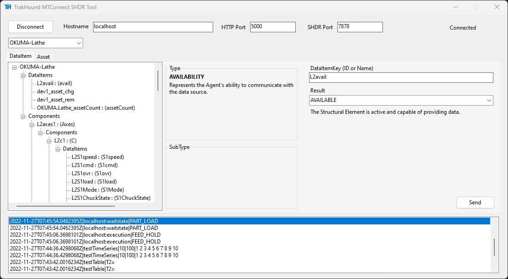
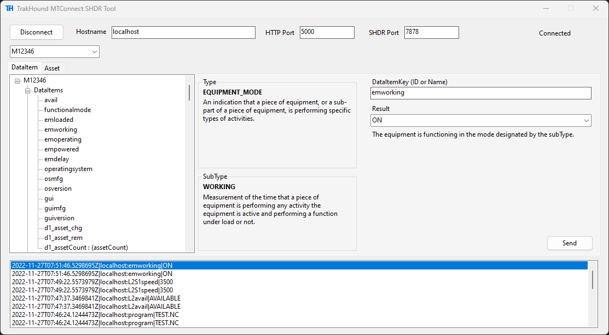
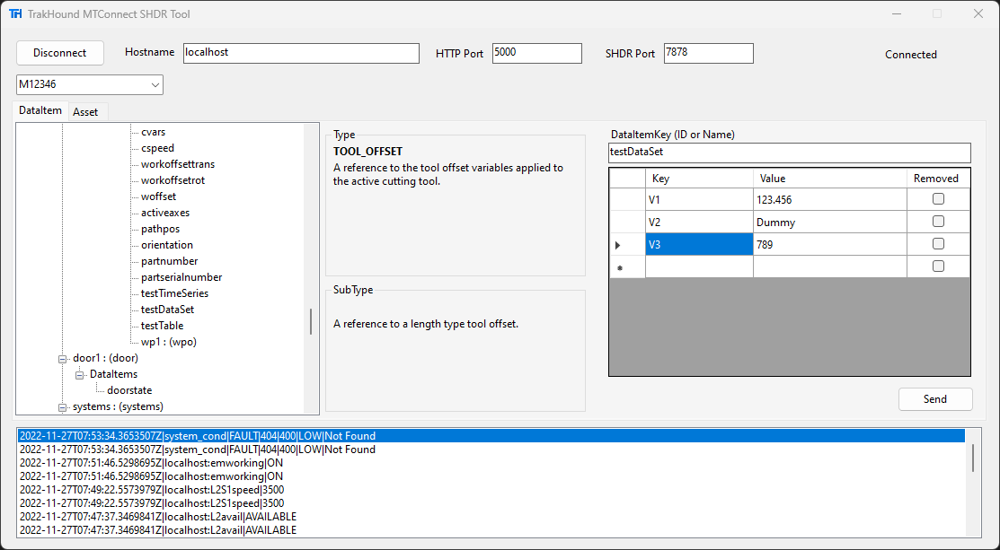
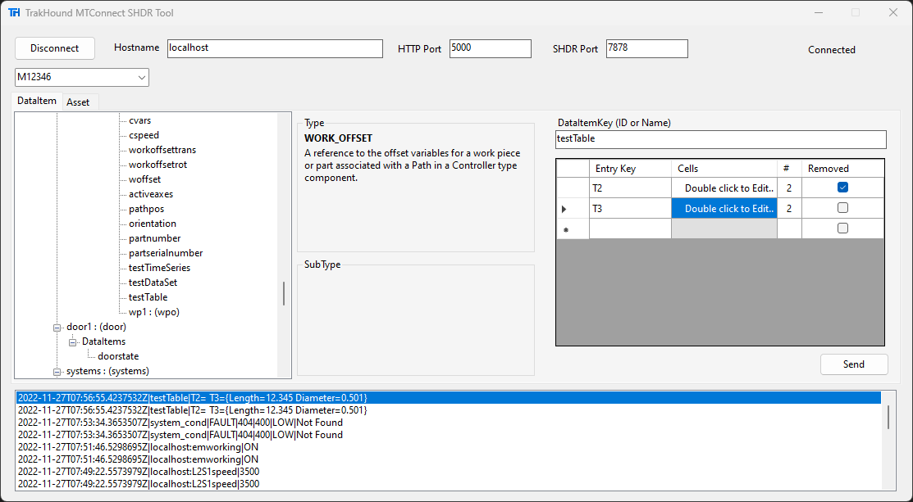
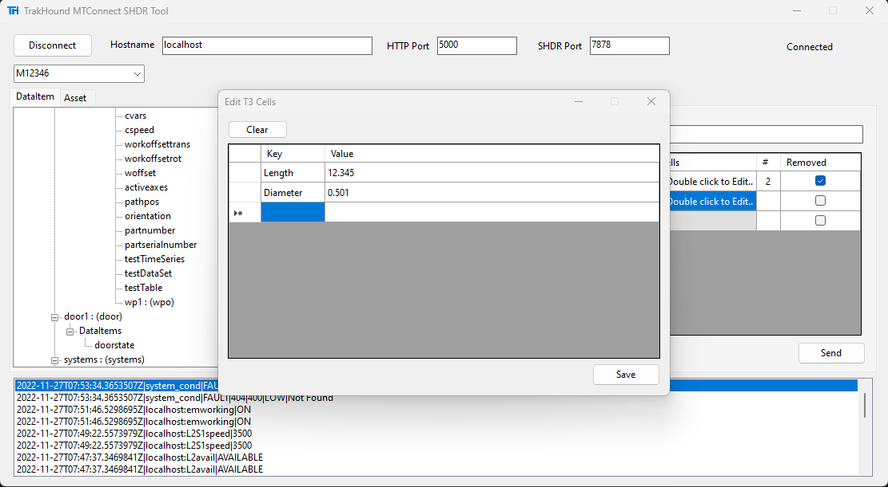
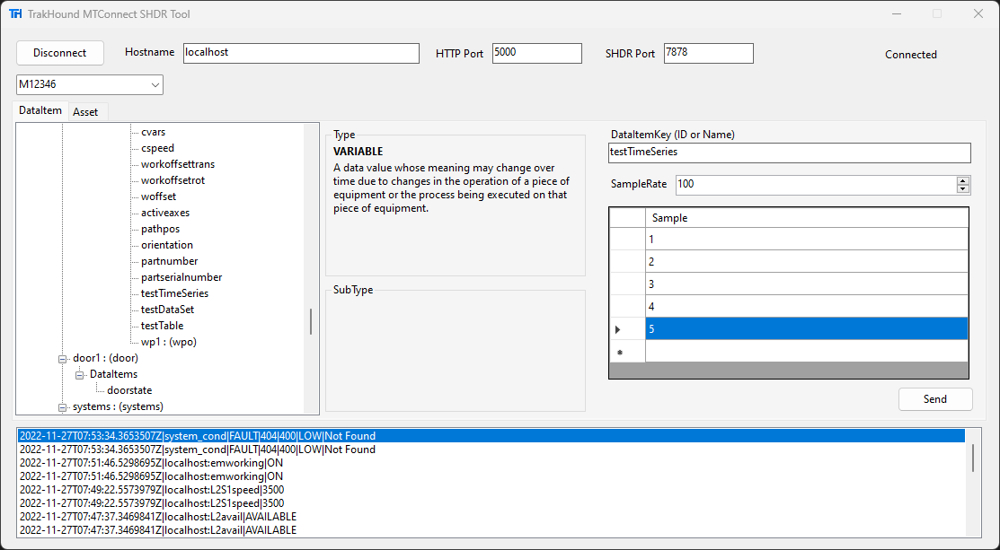
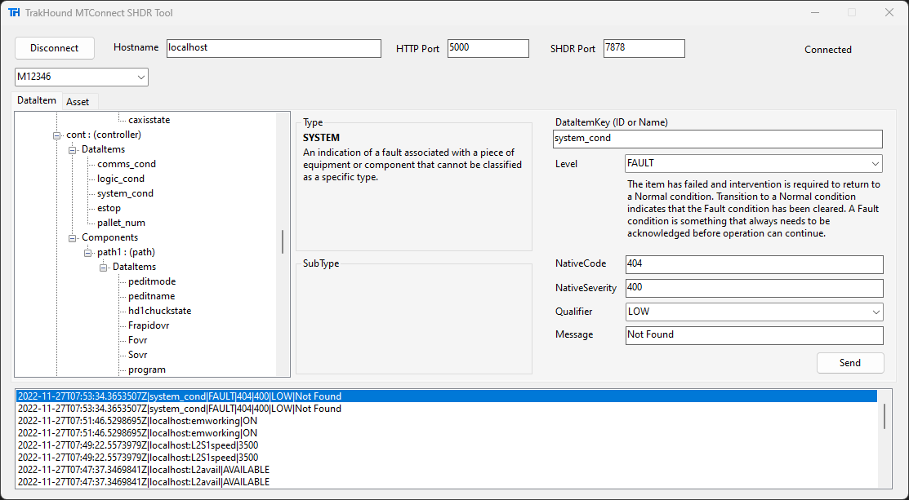
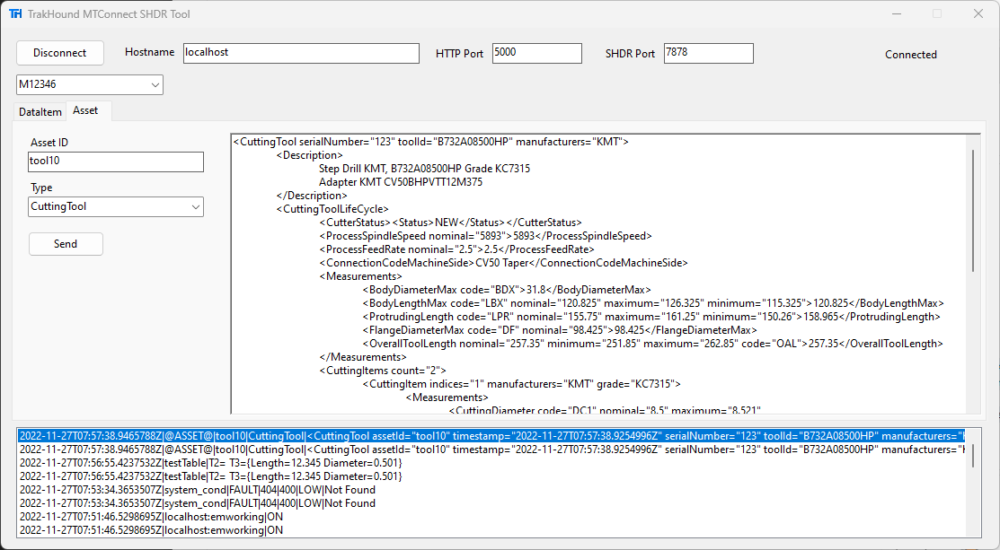
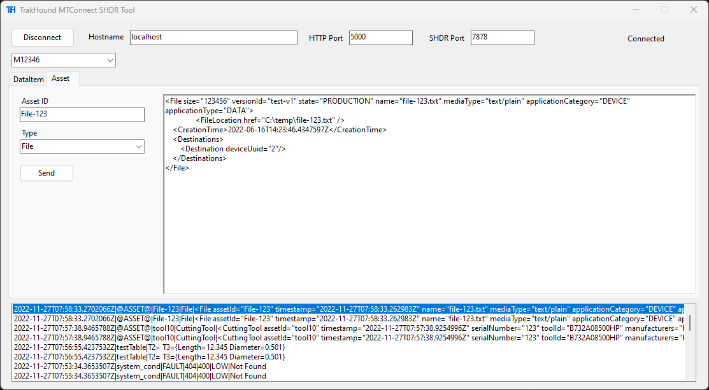

# MTConnect SHDR Tool

Diagnostic Tool for MTConnect SHDR Protocol. A simple Windows tool for sending MTConnect information over TCP using the SHDR protocol.

Features:
- Simple UI
- Reads MTConnect Model from Agent using HTTP
- Drop downs for valid Values based on DataItem Type
- Easily diagnose MTConnect Agent issues
- Send test data to and MTConnect Agent for client application testing

## Usage

### Connection
Connect to an MTConnect Agent using:
- HostName (ex. localhost)
- Http Port (ex. 5000)
- SHDR Port (ex. 7878)

### Events & Samples

#### VALUE Representation

#### DATA_SET Representation

#### TABLE Representation

#### TIME_SERIES Representation

### Conditions

### Assets

#### CuttingTool

#### File

